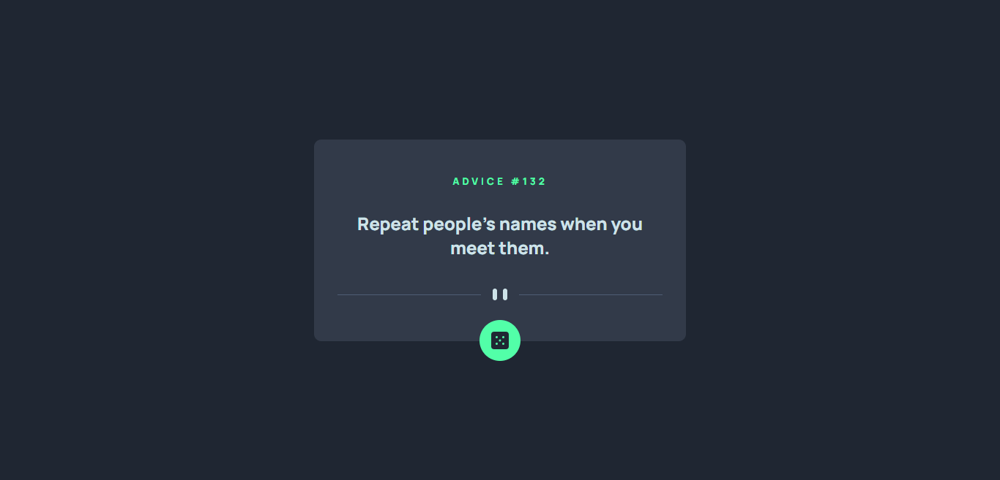
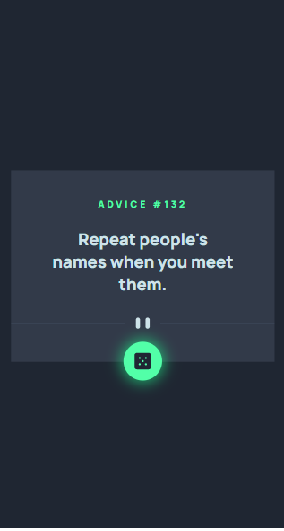

# Frontend Mentor - Advice generator app


## Table of contents

- [Frontend Mentor - Advice generator app](#frontend-mentor---advice-generator-app)
  - [Table of contents](#table-of-contents)
  - [Overview](#overview)
    - [The challenge](#the-challenge)
    - [Links](#links)
    - [Screenshot](#screenshot)
  - [My process](#my-process)
    - [Built with](#built-with)
    - [What I learned](#what-i-learned)
    - [Run the project](#run-the-project)
  - [Author](#author)

## Overview

### The challenge

Your challenge is to build out this advice generator app using the [Advice Slip API](https://api.adviceslip.com)

Users should be able to:

- View the optimal layout for the app depending on their device's screen size
- See hover states for all interactive elements on the page
- Generate a new piece of advice by clicking the dice icon
  
### Links

- Live Site URL: [Generate Advice API](https://advice-generator-api-main.netlify.app/)

### Screenshot

- here are some screenshots about the application



## My process

continue learning reactjs

### Built with

- Reactjs
- Modern CSS

### What I learned

- How to **fetch** external API with react
- Use built in hooks such **useState** and **useEffect**

### Run the project

To run this project simply install the dependencies:

```shell
   npm install 
```

## Author

- Github [@mounir-m4](https://github.com/mounir-m4)
- Twitter - [@mounirmotawakil](https://twitter.com/mounirmotawakil)
- Frontend Mentor - [@mounir-m4](https://www.frontendmentor.io/profile/mounir-m4)
